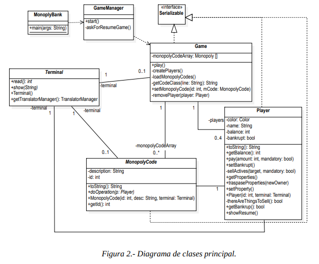
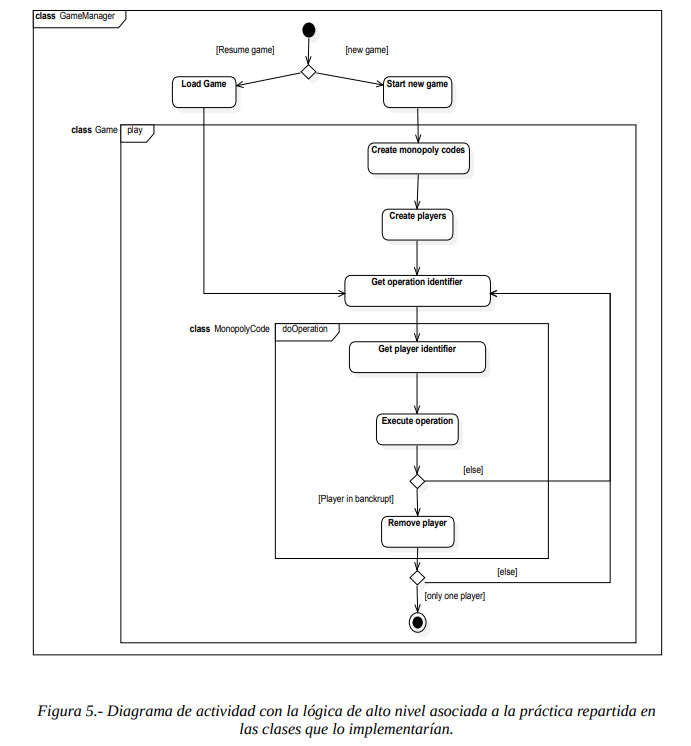

# Monopoly

## Clases



- `MonopolyBank` ~ Encargada de iniciar el juego `main`
- `GameManager` ~ Encargada de cargar partida o empezar una partida nueva
- `Game` ~ Encargada de manejar el flujo de la partida
- `Player` ~ Encargada de manejar el dinero y las propiedades de cada jugador
- `MonopolyCode` ~ Encargada de manejar las distintas operaciones del juego (tarjetas de suerte, comunidad, propiedades, etc)
- `IOManager` ~ Encargada de manejar la entrada y salida de datos (Clase *Terminal*)
  - `LanguageManager` ~ Encargada de contener el mapa de frases del idioma actual, así como de cargar el idioma seleccionado por el usuario

### Clases derivadas de los distintos tipos de operaciones (`MonopolyCode`)

- `RepairsCard` ~ Encargada de manejar las tarjetas que le pueden tocar al jugador por la cual el jugador debe pagar por cada casa y hotel que tenga
- `PaymentCard` ~ Encargada de manejar las tarjetas de pago
- `PropertyCard` ~ Encargada de manejar las tarjetas de propiedades

### Clases derivadas de las distintas propiedades

- `StreetCard` ~ Encargada de manejar las tarjetas de calles
- `ServiceCard` ~ Encargada de manejar las tarjetas de servicios
- `StationCard` ~ Encargada de manejar las tarjetas de estaciones (Clase *Transport*)

## Manejo del idioma

### Introducción

El manejo del idioma del juego se basa en un mapa que contiene las diferentes frases que el juego puede llegar a imprimir en cada uno de los escenarios posibles. Cuando el juego se inicia, este mapa se carga con las frases correspondientes al idioma seleccionado por el usuario. El mapa se actualiza cada vez que el usuario cambia el idioma. En el mapa se utiliza un ID para identificar la frase de debe ser impresa en el contexto actual. El ID es un string. Cada identificador que se use en en el código, debe ser definido en todos los archivos de idiomas disponibles junto con el equivalente en el idioma correspondiente de la frase que se quiere imprimir en el contexto actual.

### Clase `LanguageManager`

Esta clase se encarga de cargar las frases del idioma seleccionado por el usuario en un mapa. También se encargará de cambiar el idioma y proporcionar las frases correspondientes al idioma seleccionado a través de un método `getPhrase` que recibe como parámetro el identificador de la frase que se quiere imprimir.

### Ficheros de idiomas

El fichero de idioma es un fichero de texto plano que contiene las frases que el juego puede llegar a imprimir. Estos ficheros de deben llamar con el formato `idioma.txt` (*siendo `idioma` el nombre del idioma en cuestión*). Estos ficheros deben estar ubicados en la carpeta `config/languages/` del proyecto.

> ⚠️ **NOTA:** Para la implementación actual, descrita en este documento, he preferido no llamar al sistema idiomas como un *traductor* ya que como tal no se realiza ninguna traducción en ningún momento, solo se cargan strings de un mapa, el cual ya contiene las frases para el idioma seleccionado. A parte, las claves del mapa son los identificadores de las frases, no las frases en un idioma en concreto.
>
> Este sistema me permite no definir un idioma por defecto en el código, sino que el idioma por defecto es el que se carga en el mapa cuando este se crea. De esta forma, si se desea cambiar un string del idioma por defecto, o el idioma por defecto en sí, solo se debe cambiar en el fichero de idioma correspondiente y no en el código o si se desea cambiar el idioma por defecto, solo se cambia el valor de una constante. Esto también supone que el restos de archivos de idiomas no contiene el string del idioma por defecto sino solo un identificador. El  código es ajeno en todo momento al idioma de las frases, ya que solo se encarga de imprimir el string que le corresponde al identificador que se le pasa.
>
> Respecto del 

- Cada frase se encuentra en una línea distinta. 
- Cada línea tiene el siguiente formato: `ID=FRASE` (*Siendo `ID` el identificador de dicha frase y `FRASE` el string de la frase en sí*)
- Todos los archivos de idiomas deben tener los mismos identificadores definidos.
- El orden de las líneas no importa (*cada línea se identifica por su identificador*).
- Los nombres de los identificadores deben seguir la siguiente convención: 
  - No pueden contener espacios (*palabras separadas por `_`*)
  - Deben estas en mayúsculas
  - Deben describir brevemente la frase que identifican
  - Si la frase contiene una variable, esta debe aparecer en el string como `%s` (*como los placeholders de C `printf`*)
  - Los identificadores no pueden contener el carácter `=`

> **EJEMPLO**
> 
> En este caso, el identificador es `WELCOME_1` y la frase es `Welcome to Monopoly!`, que es la que se imprimirá cuando se llame a `WELCOME_1` en el código. En caso de que el idioma sea español, la frase que se imprimirá será `¡Bienvenido a Monopoly!` la cual se encuentra en el fichero `Español.txt`
> 
> - *Fichero `English.txt`*
> ```txt
> WELCOME_1=Welcome to Monopoly!
> ```
> 
> - *Fichero `Español.txt`*
> 
> ```txt
> WELCOME_1=¡Bienvenido a Monopoly!
> ```


## Flujo inicial del juego



El juego se encargará de preguntar al usuario si desea cargar una partida o empezar una nueva.

> **Cargar partida**
>
> Se deberá listar las partidas guardadas en el directorio `config/oldGames/` y el usuario seleccionará la partida que desea cargar. Las partidas guardadas se guardan en ficheros XML. Cuando el usuario seleccione la partida que desea cargar, se leerá el fichero correspondiente y se cargará el estado de la partida en el juego en el mapa `monopolyCodeArray`

> **Nueva partida**
>
> Se deberá preguntar al usuario el número de jugadores que van a jugar y el nombre/color de cada uno de ellos (*Este valor se usará como identificador del jugador*) y se cargarán los de las propiedades desde el fichero `config/MonopolyCode.txt` en el mapa `monopolyCodeArray`. 

El juego, al cargar los datos del tablero (las tarjetas de suerte, comunidad, propiedades, etc) desde el archivo `config/MonopolyCode.txt`, y los guardará en el mapa `monopolyCodeArray`. Este archivo contiene los datos de las tarjetas de suerte, comunidad, propiedades siguiendo el formato `id;class;string`. Dado que las diferentes tarjetas constan de diferentes atributos, se usará el carácter `;` para separar los atributos de cada tarjeta.

> Atributos de las tarjetas según su clase
>
> - `PAYMENT_CHARGE_CARD` -> `id;class;string` (*La cantidad a pagar aparece en el string seguida de el símbolo de `€`, esta cantidad puede ser negativa (el usuario cobra la cantidad indicada) o positiva (el usuario paga la cantidad indicada)*)
> - `STREET` -> `id;class;string;rent;w1house;w2house;w3house;w4house;whotel;housePrice;hotelPrice;mortgage`
> - `SERVICE` -> `id;class;string;w1serviceFactor;w2serviceFactor;mortgage`
> - `STATION` -> `id;class;string;rent;rent2;rent3;rent4;mortgage`
> - `REPAIRS_CARD` -> `id;class;string;pricePerHouse;pricePerHotel`

## Aspectos a tener en cuenta

- Usar **constantes** para todo lo que sea posible.
- Para los menus, usar números para seleccionar la opción deseada (*no usar letras*), para así evitar problemas con los idiomas.
- Poner en private o protected todo lo que sea posible.
- Comprobar que todos los strings están traducidos
- Comprobar que los strings se comprueban con equals

## Cosas que justificar
- ¿? Mapa de `monopolyCodes` en vez de array
- ¿? Clase estática para el LanguageManager
- ¿? Por qué no he usado colores para identificar a los jugadores
- ¿? Por qué los newGame y loadGame están en Game